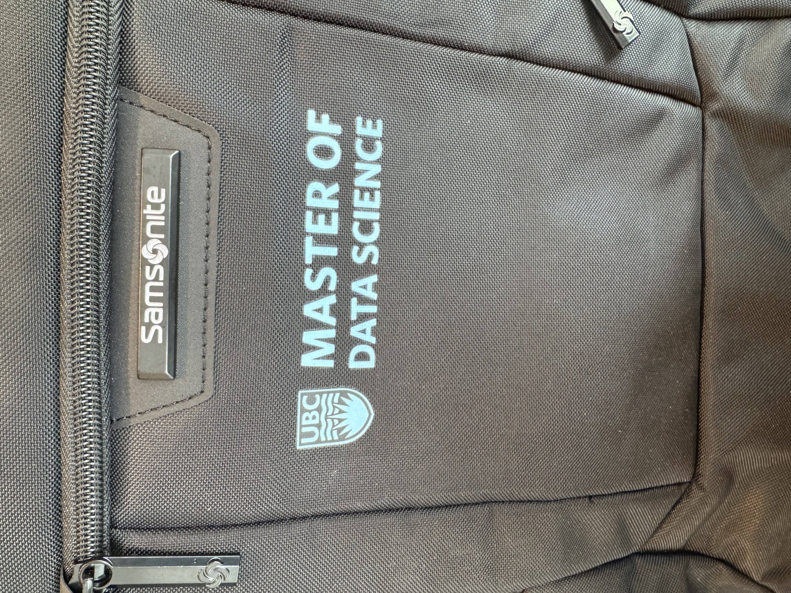

{width=250px}

## First Day at UBC

There is something strange about becoming a student again after spending a few years working full-time.

My first day at UBC was mostly a combination of finding buildings, meeting people whose names I was trying very hard to remember, and slowly realizing how much I am going to have to learn this year.

Before coming to Vancouver, I had been working as a data engineer in Kigali. Now I am back in a classroom, beginning a master’s in data science and returning to subjects I haven’t seriously studied in a while. It is exciting, but also slightly intimidating.

I don’t know exactly what this year will look like yet. For now, I’m excited to learn, rebuild some foundations I’ve forgotten, and see where the program takes me.